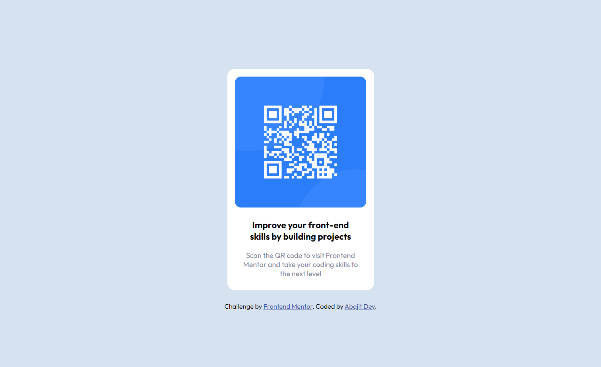

# Frontend Mentor - QR code component solution

This is a solution to the [QR code component challenge on Frontend Mentor](https://www.frontendmentor.io/challenges/qr-code-component-iux_sIO_H). Frontend Mentor challenges help you improve your coding skills by building realistic projects.

## Table of contents

- [Overview](#overview)
  - [Screenshot](#screenshot)
  - [Links](#links)
- [My process](#my-process)
  - [Built with](#built-with)
  - [What I learned](#what-i-learned)
  - [Continued development](#continued-development)
  - [Useful resources](#useful-resources)
- [Author](#author)
- [Acknowledgments](#acknowledgments)

## Overview

### Screenshot



### Links

- Solution URL: [Github repo](https://github.com/BasicallyMe/qr-code-component)
- Live Site URL: [Github page](https://basicallyme.github.io/qr-code-component/)

## My process

### Built with

- Semantic HTML5 markup
- CSS custom properties
- SCSS stylesheet

### What I learned

It was fun working on this challenge. One major thing I learned was to keep it simple without overstyling the elements too much. Learned about a new CSS property value `fit-content` for the height and width property. Also `inherit` value for different properties like border-radius, padding etc.

To see how you can add code snippets, see below:

```css
img {
  max-width: 100%;
  max-height: 100%;
  border-radius: inherit;
}
```

### Continued development

I want to continue learning about CSS properties and using HTML markup correctly.

### Useful resources

- [Fitting an image inside a container](https://stackoverflow.com/questions/3029422/how-do-i-auto-resize-an-image-to-fit-a-div-container) - This solution helped me to fit the QR image inside a div.
- [Trimming images with border radius set on parent div](https://stackoverflow.com/questions/16553042/trimming-image-corners-with-border-radius-set-on-parent-div-doesnt-work-in-safa) - This solution shows how to trim the images with border radius set on the parent div.


## Author

- Frontend Mentor - [@BasicallyMe](https://www.frontendmentor.io/profile/BasicallyMe)
- Twitter - [@yourusername](https://www.twitter.com/justAbajit)
